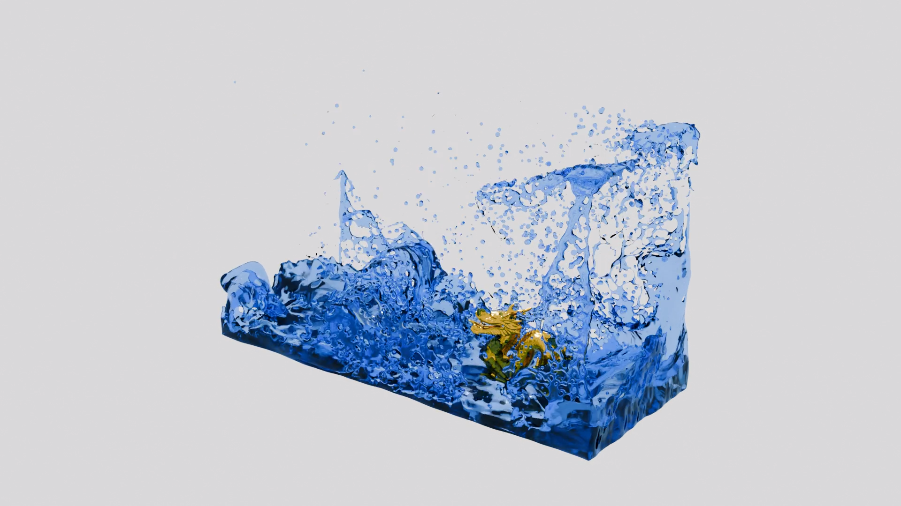
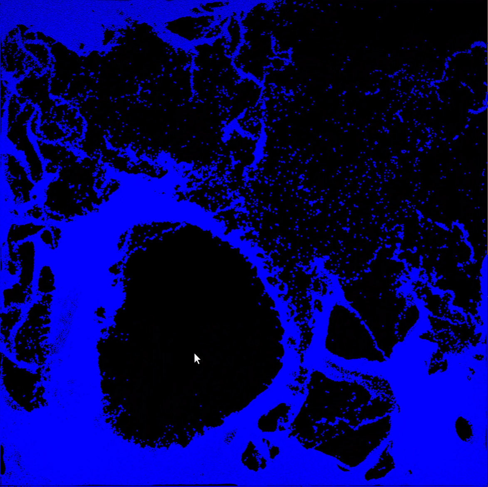

# ACG-simulation

## Overview
This project implements a comprehensive physics simulation system, focusing on the interaction between Smoothed Particle Hydrodynamics (SPH) fluids and rigid bodies. We implemented a basic 2D and 3D Weakly Compressible SPH (WCSPH) fluid simulator with robust fluid-solid coupling, reconstructed fluid surfaces, and rendered high-quality results using Blender. 

Furthermore, we developed a multithreaded rigid body simulator, a real-time interactive 2D playground, and a creative "Bad Apple" fluid animation driven by distance fields. The system demonstrates significant acceleration through GPU computing and algorithmic optimizations.

Most code is written in Taichi language.

## Demonstration
Basic fluid standard dam-break scenario.


Fluid simulation coupling with a fix rigid body.


Fluid simulation coupling with a move rigid body.


"Bad Apple" fluid simulation with a clear water wave.


Real-time interaction: Mouse cursor applying a repulsive force to the fluid particles.


Compressed demos are in `demos/`, all the uncompressed raw and rendered demos are available at [tsinghua cloud](https://cloud.tsinghua.edu.cn/d/d7a64a11f1b3435c959f/). The "Bad Apple" fluid simulation animation is uploaded to [bilibili](https://www.bilibili.com/video/BV1XZv8BZE21/?share_source=copy_web&vd_source=219034b02a3fee6a10687b0a949d28fc).


## Environment Setup

### Conda Environment
Create and activate a conda environment with the required Python version:
```bash
conda create -n acg python=3.11
conda activate acg
```

### Dependencies
Install Taichi (tested with version 1.7.4):
```bash
pip install taichi==1.7.4
pip install trimesh
pip install scipy
```
Install Rust and splashsurf for surface reconstruction:
```bash
curl --proto '=https' --tlsv1.2 -sSf https://sh.rustup.rs | sh
source $HOME/.cargo/env
cargo install splashsurf
```

### Blender
Download and install Blender 5.0 from the [official website](https://www.blender.org/download/). Ensure `blender` is in your PATH.

Alternatively, download via command line:
```bash
# Download Blender 5.0.0 (adjust version as needed)
wget https://download.blender.org/release/Blender5.0/blender-5.0.0-linux-x64.tar.xz
tar -xf blender-5.0.0-linux-x64.tar.xz
export PATH=$PWD/blender-5.0.0-linux-x64:$PATH
```

Test the setup:
```bash
python -c "import taichi as ti; print('Taichi version:', ti.__version__)"
blender --version
```


## Usage for Standard Simulation Pipeline

### Step 1: Run Fluid / Rigid Simulation
```bash
python src/run.py --scene src/configs/{scene_name}.json 
```
**Output:** 
- `output/{scene_name}/ply_output/*.ply`: particle point clouds for each frame, only for fluid;
- `output/{scene_name}/mesh_output/obj_{objectId}/obj_{objectId}_*.obj`: meshes of rigid bodies;
- `output/{scene_name}/images/*.png`: raw particle images.

For rigid body simulation, enter the directory `src/backup/` and follow the instructions in `RIGID.md`.

### Step 2: Surface Reconstruction (no need for rigid simulation)
```bash
python src/render/reconstruct_surface.py --scene src/configs/{scene_name}.json --surface-threshold 0.6
```


### Step 3: Import to Blender and Render Animation
```bash
blender --background --python src/render/render_blender.py -- --scene src/configs/{scene_name}.json
```
To resume rendering from a specific OBJ index (useful for large sequences):
```bash
blender --background --python src/render/render_blender.py -- --scene src/configs/{scene_name}.json --start-obj 100
```
**Output:** 
- `output/{scene_name}/render/*.png`: Blender rendered PNG image sequence


### Step 4: Create Video
```bash
python src/render/create_video.py -i output/{scene_name}/images -o output/{scene_name}/raw.mp4 --fps 60
```
```bash
python src/render/create_video.py -i output/{scene_name}/render -o output/{scene_name}/animation.mp4 --fps 60
```
**Output:** 
- `output/{scene_name}/raw.mp4`: video of raw particles.
- `output/{scene_name}/animation.mp4`: final Blender rendered video.

### Output Structure
```
output/{scene_name}/
├── mesh_output/
│   ├── fluid_*.obj (only for fluid scene)
│   └── obj_{objectId}/
│       └── obj_{objectId}_*.obj
├── ply_output/ (only for fluid scene)
├── images/ (only for fluid scene)
└── render/
```


## Usage for Custom Features

### Realtime Interactive Playground
```bash
python src/run.py --scene src/configs/2d.json
```
Press the left mouse button to apply attractive force to the water, right button for repulsive force.

### Bad Apple Fluid Simulation
You need to fetch the orginal frames of the video first.
```bash
python src/run.py --scene src/configs/badapple_small.json
```
Set `"exportImages": false,` and `"export2DRenders": false,` to see the raw particles effect and play with realtime mouse force. Set `"exportImages": true,` and `"export2DRenders": true,` to get raw and rendered images output. Then, create the video.
```bash
python src/render/create_video.py -i output/badapple_small/images -o output/badapple_small/raw.mp4 --fps 60
```
```bash
python src/render/create_video.py -i output/badapple_small/render -o output/badapple_small/animation.mp4 --fps 60
```
**Output:** 
- `output/badapple_small/raw.mp4`: video of raw particles.
- `output/badapple_small/animation.mp4`: final Blender rendered video.


## References
[WCSPH](https://dl.acm.org/doi/10.5555/1272690.1272719)

[rigid-fluid Coupling](https://dl.acm.org/doi/10.1145/2185520.2185558)

[SPH_Taichi](https://github.com/erizmr/SPH_Taichi)

[JFA algorithm](https://dl.acm.org/doi/abs/10.1145/1111411.1111431)

[Bad Apple!! video](https://youtu.be/i41KoE0iMYU)

[Bad Apple!! fluid simulation video](https://youtu.be/2Ni13dnAbSA?si=00X1fgYde82hsCPX)